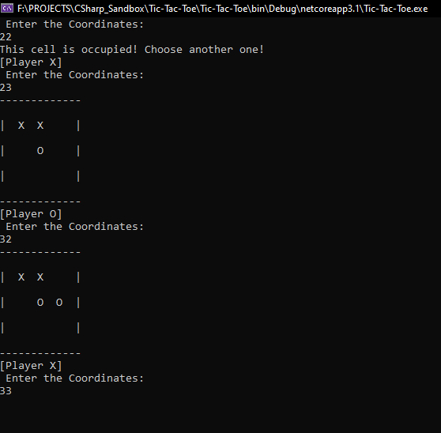

# Tic Tac Toe
I used to play this game with paper and pencil with my friends in school. I created this game while learning C# language. 
You can play this game with another player. It shows the score of "X" ,"O" players and also the draw .

## Installation
### Local Installation 

* To run this app you need dot net core sdk installed in your machine . Got to https://dotnet.microsoft.com/download to install it.  
* Clone this repo on your machine, go to Tic Tac Toe Folder 
* Then, open a command terminal and write 'dotnet run' and press Enter.
* play the game

### Live 
* To play this game with in browser go to https://repl.it/talk/share/Tic-Tac-Toe/45819

### Gameplay 🕹

